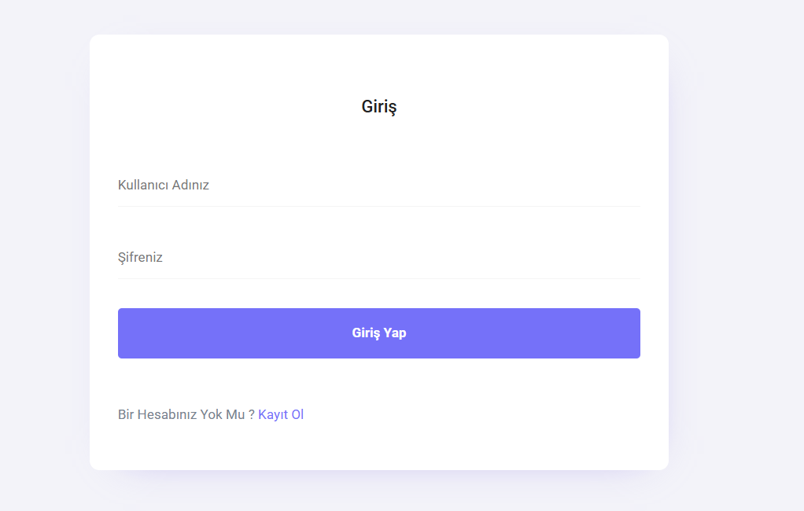
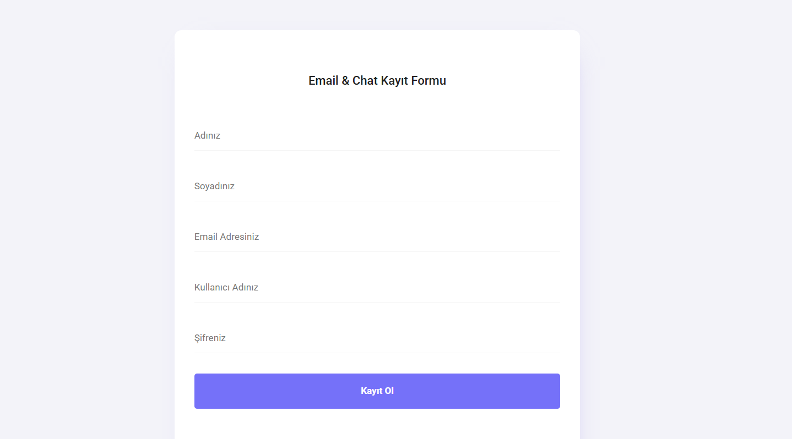
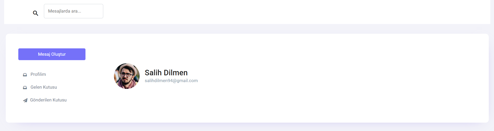
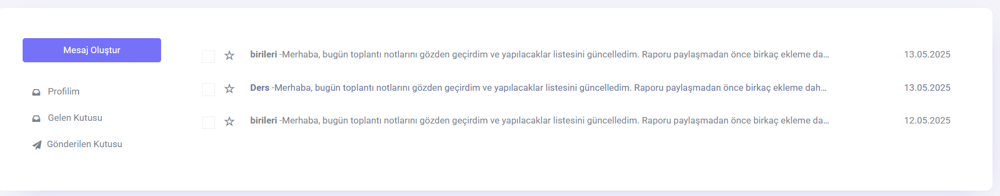
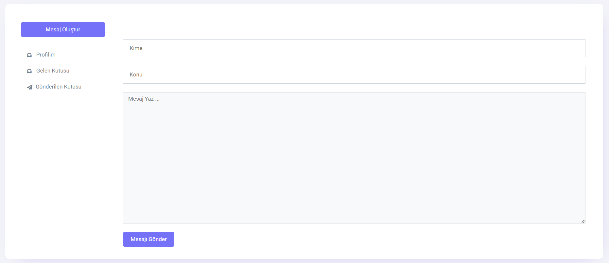
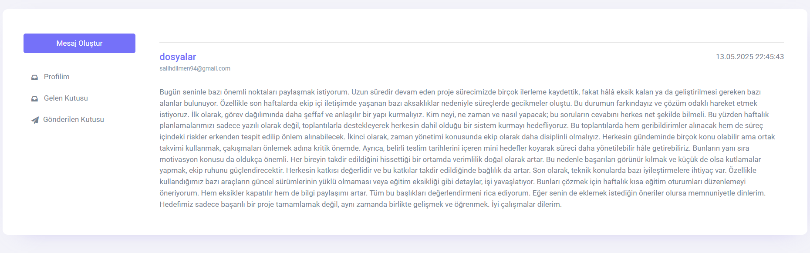
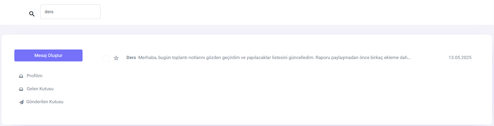

# 📬 IdentityChatMailDay

ASP.NET Core MVC ile geliştirilen basit ama güçlü bir mesajlaşma uygulaması.

## 🧰 Kullanılan Teknolojiler

Bu proje aşağıdaki teknolojilerle geliştirilmiştir:

- 🟦 **ASP.NET Core MVC** – Proje çatısı ve HTTP işleyicisi
- 🔐 **ASP.NET Identity** – Kullanıcı kimlik doğrulama ve yetkilendirme
- 🗂️ **Entity Framework Core** – ORM ve veritabanı işlemleri
- 🧠 **SQL Server** – Veritabanı yönetimi
- 🎨 **Razor Pages** – Dinamik HTML oluşturma
- 🧾 **SweetAlert2** – Bildirim ve başarı mesajları
- 🔍 **LINQ** – Veri sorgulama
- 🧰 **Bootstrap** – Responsive arayüz tasarımı
- 🧪 **.NET 8** – Framework sürümü (projene göre güncelle)

---

## 🖼️ Ekran Görüntüleri

### 🔐 Login Sayfası

### 📝 Kayıt Sayfası

### 👤 Profil Sayfası

### 📬 Gelen Kutusu (Inbox)

### 📨 Mesaj Oluşturma (Compose)

### 🧾 Mesaj Detayı

### 🔍 Arama Sonucu

---

